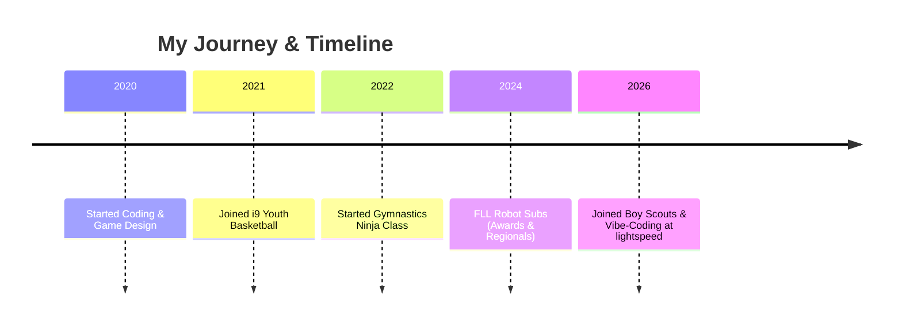

# ⚡ Parker James Tripoli

> [!IMPORTANT]
> **Vibe Coder Extraordinaire | Game Creator | FLL Robotics Champ | Boy Scout**  
> 📍 California, US | 📧 [parkertripoli@gmail.com](mailto:parkertripoli@gmail.com)

---

## 🌐 My Digital Space

---

## 🎯 Profile & Objective

I mainly **vibe code** to bring my ideas to life at lightspeed. I'm a highly creative game creator, robot champion, and scout who loves building both digital worlds and physical structures. I'm seeking opportunities to learn new tech, construct cool software projects, and collaborate with other developers.

---

## 🛠️ Skills & Powers

| Power Area | Skills & Tools |
| :--- | :--- |
| **Vibe Coding & Web** | JavaScript, HTML5, CSS3, Python, Glassmorphism, APIs |
| **Game Dev** | PenguinMod, Collision Physics, Shop/Achievement Systems |
| **Hardware & Robotics** | LEGO FLL Mindstorms programming, Structural Engineering |
| **Problem Solving** | Troubleshooting, server hosting (Minecraft), debugging |
| **Athletics** | Ninja agility (front flips), Basketball team coordination |
| **Leadership** | Scout values, FLL Core Values, teamwork |

### 🚀 Tech Badges

---

## 🚀 Experience

### 💻 Software & Game Developer
**Self-Directed | 2020 – Present**
- Developed browser-based games using HTML, CSS, and JavaScript.
- Created **"Zozer,"** a platformer game in PenguinMod featuring dynamic shop and achievement systems.
- Built **Garrio** (chat platform) and **Wizerdz** (magical web adventure).
- Designed and published **Sloth Web**, a custom web browser with extension support.
- Hosted and managed a custom **Minecraft** server.

### ⚜️ Boy Scout Member
**Boy Scouts of America | 2026 – Present**
- Active member engaging in wilderness survival training, camping trips, and community service.
- Working on merit badges including Emergency Preparedness, Wilderness Survival, and Citizenship.
- Practicing leadership, troop coordination, and team cooperation.

### 🤖 First LEGO League Team Member — *Robot Subs*
**FLL Robotics | 2024**
- Designed, built, and programmed LEGO robots under competition constraints.
- Advanced to **FLL Regional Championships**.
- Earned prestigious awards:
  - 🏆 **Rising All-Star Award** (Judges' future champions award)
  - 🛠️ **Engineering Excellence Award** (Efficient robot design)

### 🏀 Youth Basketball Player
**i9 Sports Youth League | 2021 – Present**
- Developed court vision, team play, strategy, and fitness.
- Practiced sportsmanship and coordination.

### 🤸 Ninja Class Participant
**Gymminy Kids | 2022 – Present**
- Mastered front flips, agility tracks, and coordination drills.

---

## 🏆 Key Achievements

- **Rising All-Star Award** — First LEGO League
- **Engineering Excellence Award** — First LEGO League
- Created and published multiple games and software platforms
- Launched a personal tech help website

---

## 📊 Timeline of Projects & Activities

